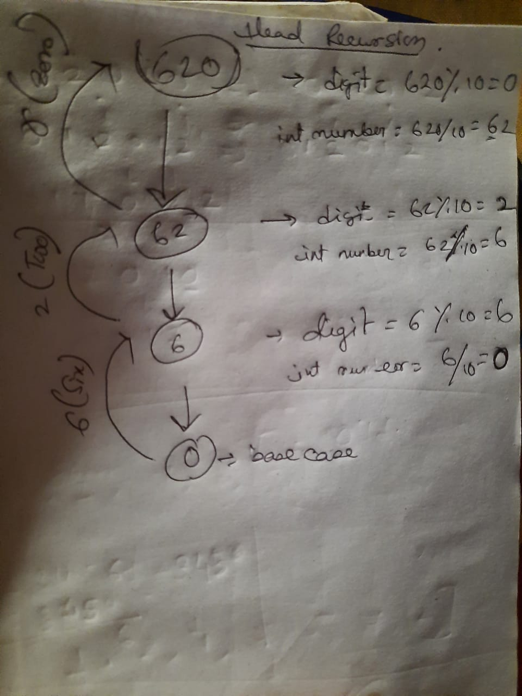

## Recursion Tree For Say A Digit

> **Say A Digit:** program tells all the digits of a given number in words. This program uses recursion for the process, more preciesely **Head Recursion**

### Check The Screenshot:
- 

